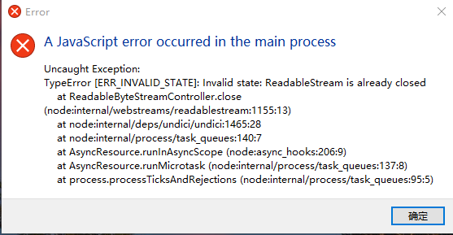

# 本地视频应用

PCV pointchangevideo 无需网络、几乎能播放所有视频格式的本地视频软件。

## 开发应用介绍

基于electron平台开发，web的video元素制作，通过ffmepg来进行全能格式播放。video能够支持播放的格式存在很多限制，除了h264、vp8/9、theora等视频编解码器硬解码，其他是通过ffmpeg软件解码。

## 主要开发依赖

| 依赖 | 依赖介绍 |
| :----: | :----: |
| [electron](https://www.electronjs.org/zh/) | 集成Chromium 和 Node.js桌面应用框架，就是把网页嵌套进桌面应用 |
| [vue3](https://cn.vuejs.org/) | 操纵数据，数据驱动视图 |
| [pinia](https://pinia.vuejs.org/zh/) | 持久化数据和状态管理 |
| [ffmpeg](https://github.com/fluent-ffmpeg/node-fluent-ffmpeg) | 处理和操纵视频、音频、字幕流 |
| [electron-vite](https://cn.electron-vite.org/) | 提供简易模板，便于操作，集中代码管理 |
| [Naive UI](https://www.naiveui.com/) | 提供多个组件，简易开发 |

## 开发应用调试与打包

```bash
# 调试
$ npm run dev

# windows 打包
$ npm run build:win
```

## 理想开发过程

正常流程是：后端读取音视频文件，前端渲染。播放遇到问题采取软件解码。

### 思考

本地应用**突出**的是： **加载快、无需等待**。

video 元素的实现： 浏览器请求多媒体数据，数据通常是buffer， 通过浏览器内置的 ffmpeg 来解码成视频流和音频流，视频流经过渲染交给video标签，而音频流经过渲染直接交给声卡；最后视频能够播放。

video标签支持硬件解码，几乎在100ms内就能播放；但**缺点**是：浏览器只支持特定的视频格式：H.264、HEVC、VP8/9、theora

特点+缺点：生成几个方案。
后端与前端处理

1. 后端转码：启动一个服务器，利用ffmpeg的pipe方法传输给前端。

    1. 转为mp4文件，前端直接用video 标签播放，实测：先得到10s片段视频需要接近500ms的长时间等待。

    2. 采取直播形式，建立rtsp服务器，ffmpeg的output传输给服务器。前端通过flv.js来播放。得到1s的视频需要4s左右。(细节：electron 的CSP拦截了flv.js转化的blob:，需要在 CSP中 media-src * blob:;设置。)

2. 后端解码成图片帧：利用ffmpeg解码图片帧不断传给前端。

    1. 前端使用一定的时间间隔去处理传过来的图片，利用canvas去渲染成视频。

3. 前端转码：利用ffmpeg.wasm 32m大小的插件。

### 实际开发过程

应用设计应该以 **快、流畅** 作为主要目的之一

选择1：
后端转码主要利用ffmpeg转码成xx.mp4格式的文件。通常为 h264+acc 解码，ffmpeg可以将视频主要分为三种流：**视频、音频、字幕**。

- 所有流单独处理：

1. 视频流：h264等浏览器支持的视频解码有硬件加速。后端主要将非h264的视频转成h264，达到支持全部格式的目的。

2. 音频流：情况多种。
   1. 只有一个音频流。直接给video标签解析。
   2. 两个以上的音频流。给audio标签解析。目的是切换音频，画面不闪烁。
   3. 只有一个音频流，但video标签解析失败，不支持该音频格式。采取后端转码成通用mp3、acc、m4a等格式；再将流传给audio。

3. 字幕流：处理起来比较麻烦。字幕分为硬字幕和软字幕。

    1. 硬字幕不用处理。
    2. 软字幕要转码为.vtt格式的文件；这才能被track标签识别。
    3. track 存在很多问题：

       - track 标签给出的属性比较少，主要是字体、背景、显隐；没有找到位置设置。
       - track只能存在于video和audio标签内，切换src，启用另外的字幕存在问题：上一个视频的字幕还显示在新的视频中。解决：点播下个视频，销毁上一个视频的字幕，比较消耗性能。
    4. 后端转码成.vtt格式需要等待。在频繁切换/点播视频会出现主进程中止，导致应用停止。尝试错误捕获，但问题暂时没有解决。错误代码：```Readablestream is already closed```
   

- 至此，所有流处理完成。整个应用通过 **path** 来传递。第一次测试前端采取原生web标签来制作大概模型，没有过多的样式。

- 后续为应用添加样式和解决字幕问题。
